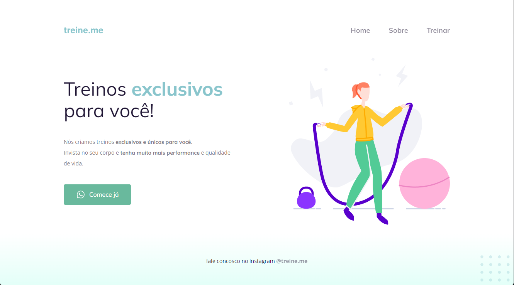

<h1 align="center"> Treine Me </h1>

Projeto desenvolvido no stage 2 do programa Explorer da RocketSeat.  

  <a href="#-tecnologias">Tecnologias</a>&nbsp;&nbsp;&nbsp;|&nbsp;&nbsp;&nbsp;
  <a href="#-projeto">Projeto</a>&nbsp;&nbsp;&nbsp;|&nbsp;&nbsp;&nbsp;
  <a href="#-layout">Layout</a>&nbsp;&nbsp;&nbsp;|&nbsp;&nbsp;&nbsp;
  <a href="#memo-licença">Licença</a>

  

 

  

## 🚀 Tecnologias

Esse projeto foi desenvolvido com as seguintes tecnologias:

- HTML
- CSS
- Git e Github
- Figma

## 💻 Projeto

Esse projeto é uma page que simula um site de academia, projeto bem simples de ser desenvolvido e ótimo para quem está iniciando na carreira de desenvolvimento Web.

- [Acesse o projeto finalizado, online](https://jhgomess.github.io/Treine-me/)

## 🔖 Layout

Você pode visualizar o layout do projeto através [DESSE LINK](<https://www.figma.com/file/1FGy55tO78c2yUUchTL6sP/Explorer---Projeto-02-(Copy)?type=design&node-id=0-1&t=k9wipliBAFIZjFiH-0>). É necessário ter conta no [Figma](https://figma.com) para acessá-lo.

## :memo: Licença

Esse projeto está sob a licença MIT.

---

Feito com ♥ by Rocketseat :wave: [Participe da nossa comunidade!](https://discord.gg/rocketseat)tseat
